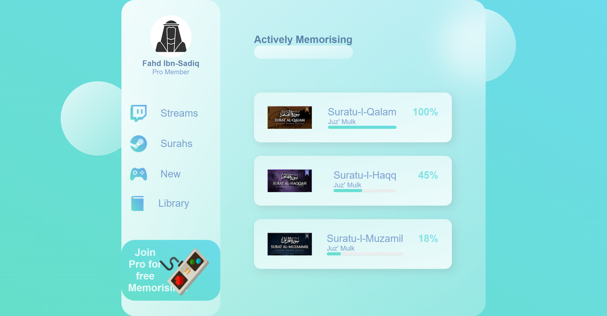

# Glass Website Project 🌐✨

A visually captivating frontend web development project showcasing transparent, glassmorphic design effects using **HTML5** and **CSS3**. The project demonstrates advanced CSS3 techniques like transparency, blur effects, and soft shadows to achieve a modern and stylish UI.
Created and completed between Thu, 30th Jun 2022 and wed, 6th Jul 2022.

## Key Features

- **Glassmorphism Design**: Incorporates semi-transparent backgrounds with subtle blur effects.  
- **Responsive Layout**: Optimized for PC screen sizes only for an engaging user experience.  
- **Custom Styling**: Unique CSS design elements for aesthetic appeal.  

## Tools and Technologies

- **HTML5**  
- **CSS3**  

## Overview

The project includes:

- A single HTML page (`index.html`) with structured and semantic markup.  
- A dedicated CSS file (`style.css`) implementing the glassmorphism styling.  
- An `images` folder containing visual assets used within the project.  

## Screenshots

  
*A glimpse of the glassmorphic styling in action.*

*Here's a screenshots of the project folder properties*

Explore the transparent elegance of this design and feel free to suggest improvements or contribute! 🌟  

## License

This repository is shared without any specific license, as it primarily serves as an educational archive.
